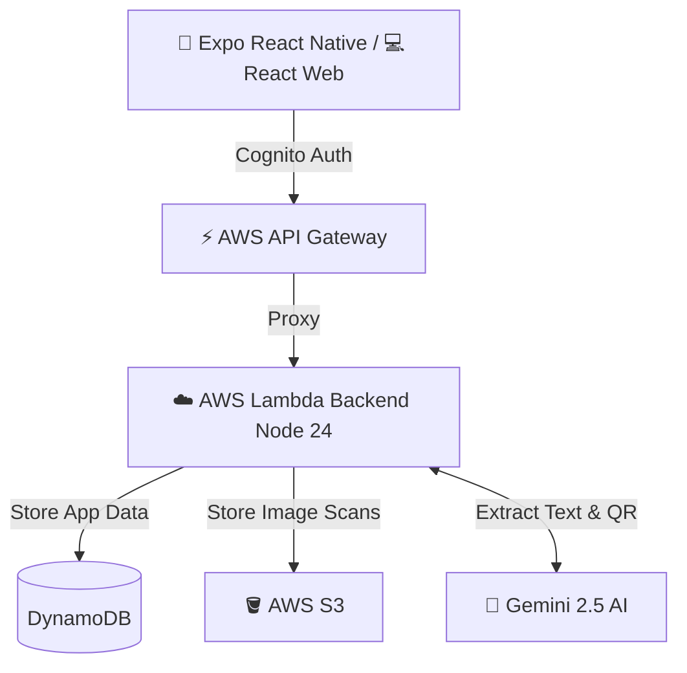

# Vaulty 🎫

> A full-stack, AI-powered coupon and voucher manager.

[](https://dxs2rcgjhblur.cloudfront.net/)


Vaulty is a modern, cross-platform application that helps users digitize, track, and utilize their coupons and vouchers. Built with a serverless architecture, it leverages AI to automatically extract key details from photos of physical receipts, streamlining the storage and retrieval process.

## 📸 See it in Action

Vaulty seamlessly captures and manages receipts. Using integrated artificial intelligence, you simply snap a photo—Vaulty automatically populates the store, discount amount, expiration dates, and QR code logic directly into the cross-platform application.

<video src="./docs/demo/Vaulty_Demo.mp4" width="800" controls></video>

## 🏗️ Architecture Stack

Vaulty handles complex state across web and mobile via a unified, serverless backend. 



## 🚀 Key Engineering Decisions

- **Full-Stack Monorepo:** Structured using NPM Workspaces. The `@coupon/shared` library enforces complete end-to-end type safety between the AI backend and all specific clients via TypeScript contracts.
- **Serverless Scale & IaC:** Completely serverless infrastructure managed via AWS SAM (CloudFormation footprint). Provides infinite scalability while scaling to zero when unused.
- **Pragmatic AI Fallbacks:** Integrates the Gemini API for intelligent data extraction, but prioritizes UX by building robust manual-entry fallback paths, cooldowns, and rate limits to elegantly handle free-tier quotas and AI hallucinations.
- **Cross-Platform Parity:** Ships both a React Native (Expo) app and a Vite React web app. Both frontends maintain UI parity and leverage the exact same API.
- **Event-Driven Push Notifications:** Leverages Amazon EventBridge for daily sweeps that trigger expiration push notifications for upcoming DynamoDB TTLs via Expo's Push API.

## 🛠️ Local Setup 

To explore this workspace locally, ensure you have Node.js (v20+) installed.

```bash
# 1. Install workspace dependencies
npm install

# 2. Run the platform of your choice:
npm run web           # Start the Vite React web server
npm run mobile        # Start the Expo React Native server

# Backend Development (Requires AWS SAM & env.json)
npm run backend:dev   # Start SAM local API 
```

## 📚 Project Deep Dive

Check out the [CLAUDE.md](./CLAUDE.md) file for a granular breakdown of the MVP status, data models, infrastructure, and CI/CD operations.
