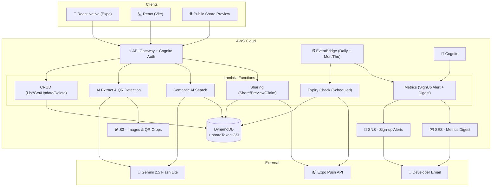
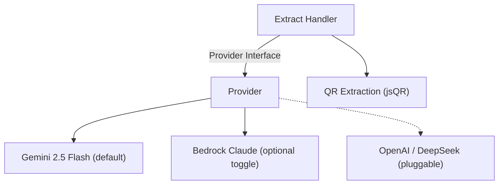
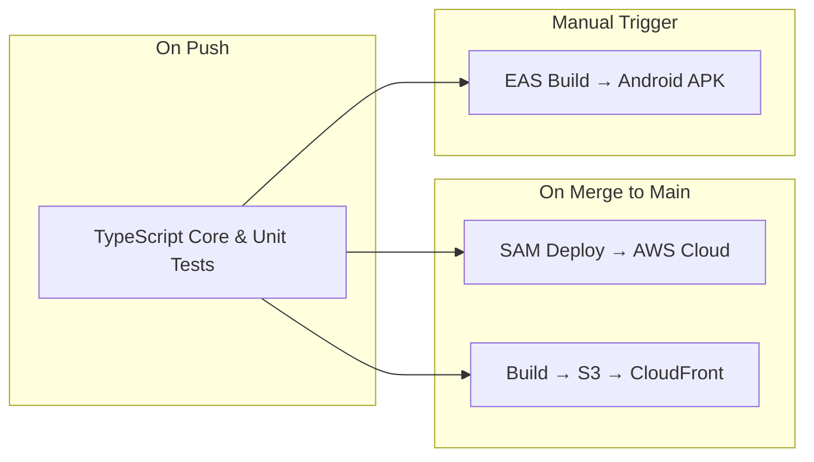

# Vaulty 🎫

> A full-stack, AI-powered coupon and voucher manager.

[](https://dxs2rcgjhblur.cloudfront.net/)
[](https://github.com/Manuel-Castellon/Vaulty/releases/latest)


Vaulty is a modern, cross-platform application that helps users digitize, track, and utilize their coupons and vouchers. Built with a serverless architecture, it leverages AI to automatically extract key details from photos of physical receipts, streamlining the storage and retrieval process.

## 📸 See it in Action

Vaulty seamlessly captures and manages receipts. Using integrated artificial intelligence, you simply snap a photo—Vaulty automatically populates the store, discount amount, expiration dates, and QR code logic directly into the cross-platform application.

https://github.com/user-attachments/assets/cf6eb0b8-d958-49b1-befa-c3a98394de4a

*If the inline video does not play, [click here to view the demo](https://github.com/Manuel-Castellon/Vaulty/blob/main/docs/demo/Vaulty_Demo.mp4).*

## 📲 Try it Out

Vaulty is fully functional across both web and mobile. Use the links below to test the AI extraction and cross-platform sync.

| Platform | Link | Status |
| :--- | :--- | :--- |
| **🌐 Web App** | [Try Vaulty in the Browser](https://dxs2rcgjhblur.cloudfront.net/) | Live Deployment |
| **📱 Android** | [Download Latest APK](https://github.com/Manuel-Castellon/Vaulty/releases/latest) | Pre-release (MVP) |

### 🛠️ Android Installation Notes
1. **Download**: Grab the latest `.apk` from the [Releases](https://github.com/Manuel-Castellon/Vaulty/releases) page.
2. **Permissions**: You may need to "Allow installation from unknown sources" in your Android settings to install the build.
3. **Login**: Use the same credentials across both platforms to see real-time sync in action.


## 🏗️ Technical Architecture

Vaulty handles complex state across web and mobile via a unified, serverless backend.

### System Overview


### LLM Provider Abstraction
The extraction pipeline is built on a provider-agnostic interface, enabling seamless switching between different AI models without modifying core handler logic.



### CI/CD Pipeline
Continuous integration ensures code quality and automated delivery to both AWS infrastructure and mobile targets.



## 🚀 Key Engineering Decisions

- **LLM Provider Abstraction:** A provider-agnostic interface that enables hot-swappable AI backends (Gemini, Bedrock, etc.) without altering handler logic or QR orchestration.
- **Structured Observability:** Real-time JSON-structured logging via CloudWatch, tracking extraction outcomes, provider performance, and latency dimensions for queryable insights.
- **Multi-Format Extraction:** A unified pipeline accepting images (JPEG, PNG, WebP), PDFs, and raw text across all platforms with native language script preservation.
- **Graceful Degradation:** Intelligent quota management that triggers QR-only extraction and manual-entry paths during periods of high demand, ensuring a resilient user experience.
- **Full-Stack Type Safety:** A unified NPM Workspaces monorepo where the `@coupon/shared` library enforces strict TypeScript contracts between the AI backend and all clients.
- **Serverless Scale & IaC:** Infrastructure-as-Code (AWS SAM / CloudFormation) ensuring a reproducible, infinitely scalable stack with zero idle cost.
- **Event-Driven Lifecycle:** Daily EventBridge schedules for DynamoDB TTL sweeps, providing proactive expiration alerts via the Expo Push API.
- **Coupon Sharing:** A sparse DynamoDB GSI on `shareToken` enables unauthenticated public preview lookups without full-table scans. Claimed coupons are independent copies—no cross-user references—keeping the data model simple at Phase 1 scale.
- **Developer Metrics:** Zero-cost operational visibility via Cognito PostConfirmation → SNS (real-time sign-up alerts) and a bi-weekly EventBridge → SES HTML digest covering user and coupon growth. No CloudWatch custom metrics ($0.30/metric/month).

## ⚖️ Tradeoffs & Limitations

- **Cold Start Latency:** Using AWS Lambda for the backend ensures zero idle cost but introduces occasional sub-second cold starts. This was accepted in favor of cost-efficiency for a B2C application with variable traffic.
- **DynamoDB Access Patterns:** The schema is optimized for lookup-by-user and expiry sweeps. While less flexible than SQL for complex joins, it offers consistent single-digit millisecond performance at scale.
- **Cost Control:** 
    - **LLM as Primary Driver:** AI extraction is the dominant cost. The architecture includes a "Fallback Mode" and quota-limiting logic to protect against bot-driven cost spikes.
    - **Serverless Efficiency:** Lambda and DynamoDB (On-Demand) were chosen specifically to maintain a "Free Tier" friendly profile while handling bursty mobile usage.
- **Gemini Quota Constraints:** Using the Flash Lite tier provides high speed and low cost, but includes rate limits. The system handles these gracefully by falling back to QR-only or manual entry paths.
- **Throughput Assumptions:** The current architecture prioritizes per-request responsiveness over massive batch processing, fitting the "snap-and-save" mobile user flow.

## 📊 Observability & Insights

Vaulty has two tiers of observability: real-time structured logs for system health, and a lightweight developer metrics pipeline for business-level tracking.

### Structured CloudWatch Logs

All Lambda functions emit JSON-structured events queryable via CloudWatch Insights:

**Example: Extraction Success Rate (Last 24h)**
```sql
fields @timestamp, event, outcome, provider, durationMs
| filter event = "extract.completed" or event = "extract.failed"
| stats count() as total, count_distinct(outcome) by outcome
| sort total desc
```

### Developer Metrics Pipeline

Two lightweight mechanisms surface business-level data without CloudWatch custom metric costs:

- **Sign-up Alerts:** Cognito PostConfirmation → SNS → email. Fires within seconds of each verified registration.
- **Bi-weekly Digest:** EventBridge (Mon + Thu 8AM UTC) → Lambda → SES HTML email. Reports total users, new users, total coupons, and breakdowns by category, status, and item type—all queried live from DynamoDB and Cognito at send time.

## 🛠️ Local Setup 

To explore this workspace locally, ensure you have Node.js (v20+) installed.

```bash
# 1. Install workspace dependencies
npm install

# 2. Run the platform of your choice:
npm run web           # Start the Vite React web server
npm run mobile        # Start the Expo React Native server

# Backend Development (Requires AWS SAM & env.json)
npm run backend:dev   # Start SAM local API 
```

## 📚 Project Deep Dive

Check out the [CLAUDE.md](./CLAUDE.md) file for a granular breakdown of the MVP status, data models, infrastructure, and CI/CD operations.
